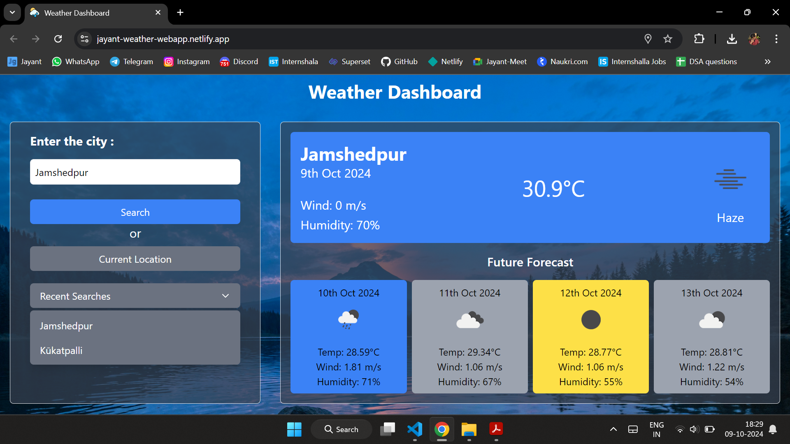

# Jayant Weather App

A simple weather dashboard that provides current weather data and a future forecast for a selected city or the user's current location. Built using JavaScript, HTML, Tailwind CSS, and the OpenWeatherMap API.

## Features

Features

- **Search Weather by City Name:** Users can enter any city name in the search bar to view its current weather and a forecast. This feature allows for a quick and convenient way to check the weather conditions of any desired location.

- **Retrieve Current Weather and future Forecast Data:** The app provides instant access to current weather information, including temperature, wind speed, and humidity. Additionally, users can view a future forecast, helping them plan for upcoming weather changes.

- **Location-Based Weather Information (Using Geolocation):** By clicking the "Current Location" button, users can receive weather data for their current location. This feature, leveraging geolocation, automatically detects the user's position and displays the relevant weather information.

- **Recent City Search History Saved Locally:** Recently searched cities are saved locally within the browser and can be accessed quickly through a dropdown menu. This history is saved across sessions, enabling users to revisit frequently checked locations without retyping the city name.

- **User-Friendly, Responsive UI Using Tailwind CSS:** The interface is designed for ease of use, ensuring weather data is displayed in a clean, readable format. Tailwind CSS helps make the design responsive, meaning it adapts smoothly to various screen sizes, from desktops to mobile devices. This approach ensures accessibility and a consistent experience across different devices.

## Demo

Check out the app live at: [Jayant Weather App](https://jayant-weather-webapp.netlify.app/)

## Screenshots



## Installation

1. Clone the repository:

   ```bash
   git clone https://github.com/goyal1510/jayant-weather-app.git
   cd jayant-weather-app
   ```

2. Open `index.html` in a browser.

## Usage

- Enter a city name in the search field and click "Search" to get the weather data.
- Click on "Current Location" to get weather data for your current location.
- Use the "Recent Searches" dropdown to quickly access previously searched cities.

## Project Structure

```
jayant-weather-app/
├── index.html                 # Main HTML structure of the app
├── script.js                  # JavaScript file for fetching weather data and managing user interactions
├── style.css                  # Custom styling with Tailwind CSS integration
├── resources/
    └── weather-favicon/       # Directory for app icons and images used in the UI
    └── Background.jpg         # Background Image used in UI
└── README.md

```

## API Reference

This project uses the [OpenWeatherMap API](https://openweathermap.org/) to fetch weather data.
